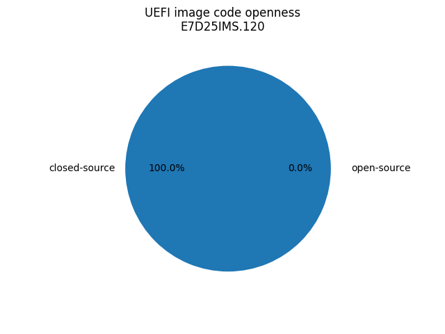

# Dasharo Openness Score

Openness Score for E7D25IMS.120

Open-source code percentage: **0.0%**
Closed-source code percentage: **100.0%**

* Image size: 33554432 (0x2000000)
* Number of entries: 2856
* Number of regions: 3
* Number of volumes: 8
* Total open-source files size: 0 (0x0)
* Total closed-source files size: 11540861 (0xb0197d)
* Total data size: 143376 (0x23010)
* Total empty size: 21870195 (0x14db673)

> Numbers given above already include the calculations from UEFI volumes
> presented below. Only top level volumes have been presented

## UEFI regions

| Region | Base | Size | Category |
| ------ | ---- | ---- | -------- |
| ME | 0x1000 | 0x3d8000 | closed-source |
| Descriptor | 0x0 | 0x1000 | data |
| Non-empty | 0x17c0000 | 0x20000 | data |
| Empty (0xFF) | 0x3d9000 | 0xc27000 | empty |
| Empty (0xFF) | 0x1040000 | 0x50000 | empty |

> These are regions defined by Intel flash descriptor but also holes
> between those regions and UEFI Volumes which may or may not be empty.

## UEFI Volume FA4974FC-AF1D-4E5D-BDC5-DACD6D27BAEC

* Base: 0x1000000
* Size: 0x40000
* Number of entries: 26
* Open-source code size: 0 (0x0)
* Closed-source code size: 10909 (0x2a9d)
* Data size: 0 (0x0)
* Empty size: 251235 (0x3d563)

> The table below is just a simplified view of top level volume entries
> categorized as file that are known to contain either data or empty space.
> Everything else is considered closed-source.

| Filename | File type | File subtype | Base | Size | Category |
| -------- | --------- | ------------ | ---- | ---- | -------- |
| Free space | Free space |  | 0x100298d | 0x10 | empty |
| Free space | Free space |  | 0x1002a9d | 0x3d553 | empty |

## UEFI Volume 4F1C52D3-D824-4D2A-A2F0-EC40C23C5916

* Base: 0x1090000
* Size: 0x730000
* Number of entries: 1879
* Open-source code size: 0 (0x0)
* Closed-source code size: 5190992 (0x4f3550)
* Data size: 0 (0x0)
* Empty size: 2345648 (0x23cab0)

> The table below is just a simplified view of top level volume entries
> categorized as file that are known to contain either data or empty space.
> Everything else is considered closed-source.

| Filename | File type | File subtype | Base | Size | Category |
| -------- | --------- | ------------ | ---- | ---- | -------- |
| Volume free space | Free space |  | 0x1583550 | 0x23cab0 | empty |

## UEFI Volume AFDD39F1-19D7-4501-A730-CE5A27E1154B

* Base: 0x17e0000
* Size: 0x200000
* Number of entries: 12
* Open-source code size: 0 (0x0)
* Closed-source code size: 1132544 (0x114800)
* Data size: 8208 (0x2010)
* Empty size: 956400 (0xe97f0)

> The table below is just a simplified view of top level volume entries
> categorized as file that are known to contain either data or empty space.
> Everything else is considered closed-source.

| Filename | File type | File subtype | Base | Size | Category |
| -------- | --------- | ------------ | ---- | ---- | -------- |
| Padding | Padding | Non-empty | 0x18f4800 | 0x2010 | data |
| Volume free space | Free space |  | 0x18f6810 | 0xe97f0 | empty |

## UEFI Volume 3DA4F21C-189D-46A3-98C0-AF814EBF01B0

* Base: 0x19e0000
* Size: 0x120000
* Number of entries: 144
* Open-source code size: 0 (0x0)
* Closed-source code size: 198760 (0x30868)
* Data size: 0 (0x0)
* Empty size: 980888 (0xef798)

> The table below is just a simplified view of top level volume entries
> categorized as file that are known to contain either data or empty space.
> Everything else is considered closed-source.

| Filename | File type | File subtype | Base | Size | Category |
| -------- | --------- | ------------ | ---- | ---- | -------- |
| Volume free space | Free space |  | 0x1a10868 | 0xef798 | empty |

## UEFI Volume 8C8CE578-8A3D-4F1C-9935-896185C32DD3

* Base: 0x1b00000
* Size: 0x260000
* Number of entries: 104
* Open-source code size: 0 (0x0)
* Closed-source code size: -216816 (-0x34ef0)
* Data size: 0 (0x0)
* Empty size: 2707184 (0x294ef0)

> The table below is just a simplified view of top level volume entries
> categorized as file that are known to contain either data or empty space.
> Everything else is considered closed-source.

| Filename | File type | File subtype | Base | Size | Category |
| -------- | --------- | ------------ | ---- | ---- | -------- |
| Volume free space | Free space |  | 0x1b458c0 | 0x7a7b0 | empty |
| Volume free space | Free space |  | 0x1bc0070 | 0x19ff90 | empty |

## UEFI Volume 52F1AFB6-78A6-448F-8274-F370549AC5D0

* Base: 0x1d60000
* Size: 0x160000
* Number of entries: 42
* Open-source code size: 0 (0x0)
* Closed-source code size: 690960 (0xa8b10)
* Data size: 0 (0x0)
* Empty size: 750832 (0xb74f0)

> The table below is just a simplified view of top level volume entries
> categorized as file that are known to contain either data or empty space.
> Everything else is considered closed-source.

| Filename | File type | File subtype | Base | Size | Category |
| -------- | --------- | ------------ | ---- | ---- | -------- |
| Volume free space | Free space |  | 0x1e08b10 | 0xb74f0 | empty |

## UEFI Volume 7BEBD21A-A1E5-4C4C-9CA1-A0C168BCBD9D

* Base: 0x1ec0000
* Size: 0x40000
* Number of entries: 6
* Open-source code size: 0 (0x0)
* Closed-source code size: 21824 (0x5540)
* Data size: 0 (0x0)
* Empty size: 240320 (0x3aac0)

> The table below is just a simplified view of top level volume entries
> categorized as file that are known to contain either data or empty space.
> Everything else is considered closed-source.

| Filename | File type | File subtype | Base | Size | Category |
| -------- | --------- | ------------ | ---- | ---- | -------- |
| Volume free space | Free space |  | 0x1ec5540 | 0x3aac0 | empty |

## UEFI Volume 61C0F511-A691-4F54-974F-B9A42172CE53

* Base: 0x1f00000
* Size: 0x100000
* Number of entries: 321
* Open-source code size: 0 (0x0)
* Closed-source code size: 481224 (0x757c8)
* Data size: 0 (0x0)
* Empty size: 567352 (0x8a838)

> The table below is just a simplified view of top level volume entries
> categorized as file that are known to contain either data or empty space.
> Everything else is considered closed-source.

| Filename | File type | File subtype | Base | Size | Category |
| -------- | --------- | ------------ | ---- | ---- | -------- |
| Free space | Free space |  | 0x1f6f665 | 0x10 | empty |
| Free space | Free space |  | 0x1f6f775 | 0x10 | empty |
| Free space | Free space |  | 0x1f6f7e8 | 0x8a818 | empty |
