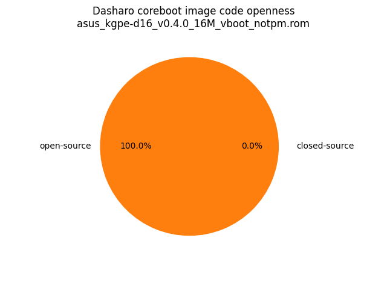

# Dasharo Openness Score

Openness Score for asus_kgpe-d16_v0.4.0_16M_vboot_notpm.rom

Open-source code percentage: **100.0%**
Closed-source code percentage: **0.0%**

* Image size: 16777216 (0x1000000)
* Number of regions: 19
* Number of CBFSes: 2
* Total open-source code size: 909766 (0xde1c6)
* Total closed-source code size: 0 (0x0)
* Total data size: 765974 (0xbb016)
* Total empty size: 15101476 (0xe66e24)

> Numbers given above already include the calculations from CBFS regions
> presented below

## FMAP regions

| FMAP region | Offset | Size | Category |
| ----------- | ------ | ---- | -------- |
| RECOVERY_MRC_CACHE | 0x0 | 0x10000 | data |
| RW_MRC_CACHE | 0x10000 | 0x10000 | data |
| SMMSTORE | 0x20000 | 0x40000 | data |
| CONSOLE | 0x60000 | 0x20000 | data |
| RW_NVRAM | 0x80000 | 0x4000 | data |
| VBLOCK_A | 0x84000 | 0x2000 | data |
| RW_FWID_A | 0xbfffc0 | 0x40 | data |
| RO_VPD | 0xc00000 | 0x4000 | data |
| FMAP | 0xc04000 | 0x800 | data |
| RO_FRID | 0xc04800 | 0x40 | data |
| RO_FRID_PAD | 0xc04840 | 0x7c0 | data |
| GBB | 0xc05000 | 0x4000 | data |

## CBFS FW_MAIN_A

* CBFS size: 12033984
* Number of files: 12
* Open-source files size: 426095 (0x6806f)
* Closed-source files size: 0 (0x0)
* Data size: 87761 (0x156d1)
* Empty size: 11520128 (0xafc880)

> Numbers given above are already normalized (i.e. they already include size
> of metadata and possible closed-source LAN drivers included in the payload
 > which are not visible in the table below)

| CBFS filname | CBFS filetype | Size | Compression | Category |
| ------------ | ------------- | ---- | ----------- | -------- |
| fallback/romstage | stage | 171760 | none | open-source |
| fallback/ramstage | stage | 96204 | LZMA | open-source |
| fallback/dsdt.aml | raw | 4962 | none | open-source |
| fallback/postcar | stage | 21908 | none | open-source |
| img/nvramcui | simple elf | 70630 | none | open-source |
| fallback/payload | simple elf | 60631 | none | open-source |
| config | raw | 1106 | none | data |
| revision | raw | 845 | none | data |
| build_info | raw | 94 | none | data |
| payload_config | raw | 1544 | none | data |
| payload_revision | raw | 237 | none | data |

## CBFS COREBOOT

* CBFS size: 4157440
* Number of files: 19
* Open-source files size: 483671 (0x76157)
* Closed-source files size: 0 (0x0)
* Data size: 92421 (0x16905)
* Empty size: 3581348 (0x36a5a4)

> Numbers given above are already normalized (i.e. they already include size
> of metadata and possible closed-source LAN drivers included in the payload
 > which are not visible in the table below)

| CBFS filname | CBFS filetype | Size | Compression | Category |
| ------------ | ------------- | ---- | ----------- | -------- |
| fallback/romstage | stage | 171760 | none | open-source |
| fallback/ramstage | stage | 96204 | LZMA | open-source |
| fallback/dsdt.aml | raw | 4962 | none | open-source |
| fallback/postcar | stage | 21908 | none | open-source |
| img/nvramcui | simple elf | 70630 | none | open-source |
| fallback/payload | simple elf | 60631 | none | open-source |
| fallback/verstage | stage | 43880 | none | open-source |
| bootblock | bootblock | 13696 | none | open-source |
| header | cbfs header | 32 | none | data |
| config | raw | 1106 | none | data |
| revision | raw | 845 | none | data |
| build_info | raw | 94 | none | data |
| cmos.default | cmos_default | 256 | none | data |
| cmos_layout.bin | cmos_layout | 3792 | none | data |
| payload_config | raw | 1544 | none | data |
| payload_revision | raw | 237 | none | data |
| etc/sercon-port | raw | 8 | none | data |
| (empty) | null | 3581348 | none | empty |
